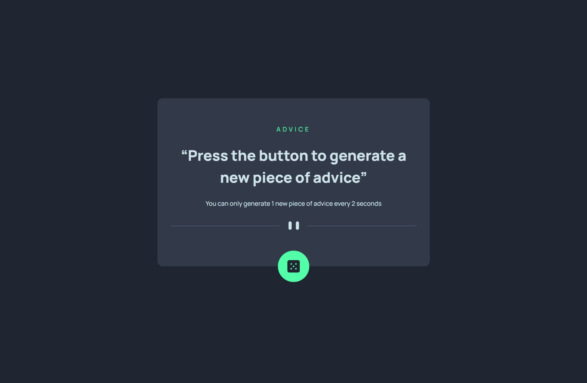

# Frontend Mentor - Advice generator app

This is a solution to the [advice generator app challenge on Frontend Mentor](https://www.frontendmentor.io/challenges/advice-generator-app-QdUG-13db). Frontend Mentor challenges help you improve your coding skills by building realistic projects.

### Difficulty: `junior`

## Table of contents

- [Overview](#overview)
  - [The challenge](#the-challenge)
  - [Links](#links)
  - [Useful resources](#useful-resources)
- [Author](#author)

## Overview

### The challenge

To build the huddle landing page according to the given designs as close as possible.
The users should be able to:

- View the optimal layout for the page depending on their device's screen size
- See hover states for all interactive elements on the page

### Links

- Solution URL: [Open GitHub repository](https://github.com/YariMorcus/advice-generator-app)
- Live Site URL: [open Netlify page](https://yarimorcus.github.io/huddle-landing-page)

### Useful resources

- [Transfonter](https://transfonter.org) - Has been used to convert the downloaded font files to woff and woff2 (most recent font formats, supported in all major browsers), and generate the corresponding `@font-face` css rulesets
- [Frontend Mentor - Advice generator app challenge on Frontend Mentor](https://www.frontendmentor.io/challenges/advice-generator-app-QdUG-13db)

## Author

- LinkedIn - [Yari Morcus](https://www.linkedin.com/in/yarimorcus) _(must be logged in)_
- Frontend Mentor - [@YariMorcus](https://www.frontendmentor.io/profile/YariMorcus)
